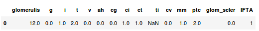
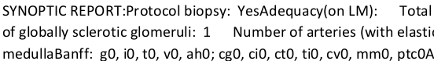
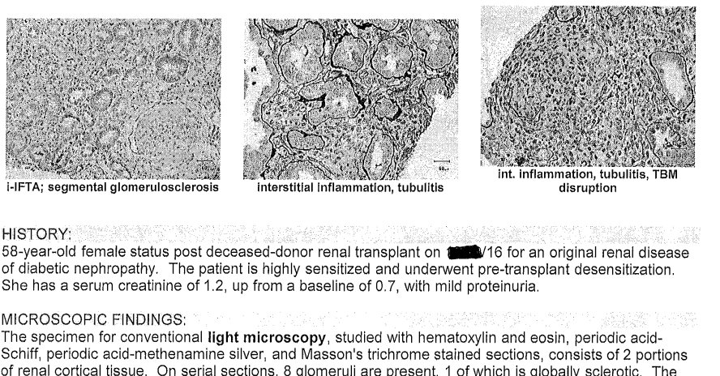
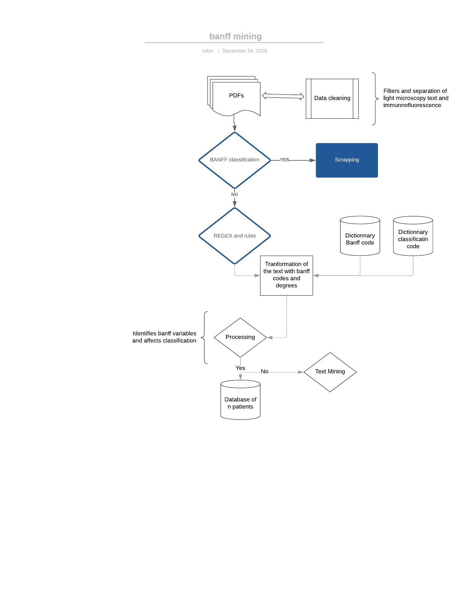

# Banff Mining
### V1
Robin Masliah & Gillian Divard
---

### Méthode 1

- Scrapping des données brutes.
- Création dataframe.
- Export CSV. 

 
- Base de référence.
---

### Méthode 1

---
### Méthode 1

---
### Méthode 1
Cleaning :
- Split des phrases.
- Interactions avec le dictionnaire.
- Suppression des stop words.
- Ex : Vessels: The  cv  show focal  2  intimal  fibrosis.
 cv = 2
---
### Méthode 1
Erreur :
- Sur 5 textes > Environ 10-20% d'erreur.
---
### Méthode 1 : Métrique
- Matrice de confusion : 70-75%
---
### V2
- Vectorisation des phrases.
- Désambiguation.
- Étude du contexte.
---
### V2
- Automatisation V1 (75% fait)
- Ne reste qu'à mettre le tout dans une base de donnée CSV.
---
### V2
- Création de la métrique de validation : AUC, matrice de confusion
---
### V2 cleaning approffondi
- Stemming : transforme tous les mots et suffixes (ex : verbe conjugué -> singulier)
- Lemmatization : transforme un mot en son mot racine (surcouche du stemming)
- Spelling correction : TextBlob 
---
### V2 tf-idf
- Identifier les bonnes phrases : Calcul tf-idf
- Calcul term frequency
- idf = Si un mot est présent plusieurs fois on considèrera qu'il n'est pas très utile.
- IDF = log(N/n), N est le nombre de phrases et n occurrence d'un mot.
- Peut donner indices sur la phrase à prendre en compte.
---
### V2 Approche analyse de sentiment 
- Ne pas changer les numérotations via dictionnaire degrés.
- Calculer probabilité d'être entre 0 et 2.
- Déterminer seuil de classification (-> régression logistique...?).
---
### V2 Approche étude similarité entre les textes 
- Vectorisation.
- Calcul matrice de similarité entre des textes.
- Prendre plusieurs textes en référence et les comparer à d'autres non banffé.
- Avantages : réelle approche text mining et assez efficace.
- Inconvénient : temps de calcul important.

